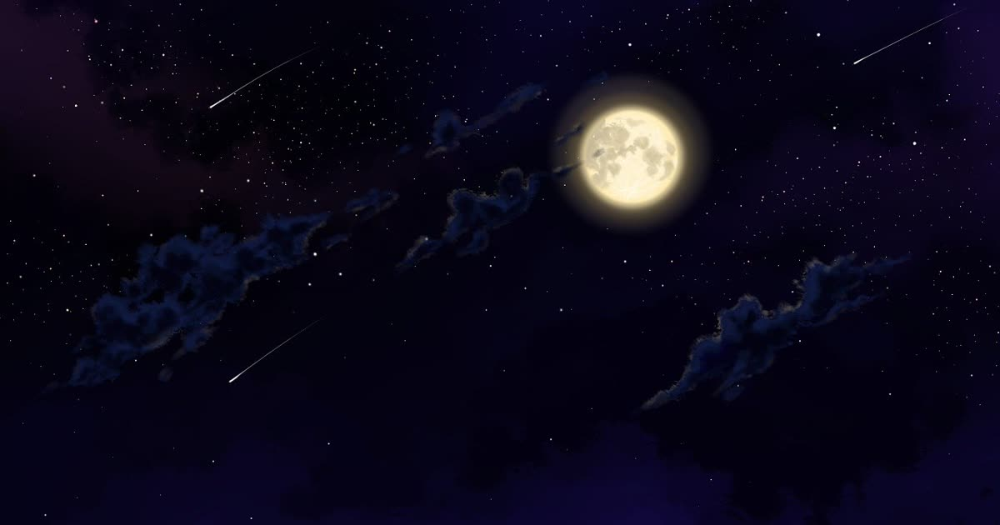

# Manuliatina — *Forest Lullaby*

A browser-based **interactive visual novel** built in React. The game runs on a small, data-driven scene graph — branching story, atmospheric music, time-of-day art, save/load, and full EN/UK/RU localization.

▶ **Play it live:** [www.manuliatina.com](https://www.manuliatina.com) · 🌐 English / Українська / Русский

<!-- Add a screenshot or GIF here for the strongest first impression:

-->

## What it does

*Forest Lullaby* is a short atmospheric story you play in the browser — 30 scenes, 30 music tracks, 51 hand-picked backgrounds, driven by a data-driven scene system kept separate from the story content.

- **Data-driven scene graph** — the entire story lives in a single [`locations.js`](src/locations.js) map. Each node declares its art, music, and navigation choices; the engine does the rest. Adding a scene means adding an object, not writing code.
- **Time-of-day rendering** — every scene can define distinct art and music for `sunrise` / `day` / `sunset` / `night`, resolved live against the player's real clock, with graceful fallbacks.
- **Branching choices** — player decisions route through the graph, including timed auto-advance scenes that return to a previous location.
- **Probabilistic "luck" & "special" events** — scenes can roll for alternate art or hidden branches based on chance, time of day, and choices made earlier in the run.
- **Layered audio** — up to two looping background tracks plus one-shot "talk" cues, each with independent volume logic, built on [`react-sound`](https://github.com/leoasis/react-sound) / SoundManager2.
- **Save / load** — multiple slots persisted to `localStorage`, with timestamps.
- **Backlog** — scrollable history of visited scenes.
- **Full i18n** — English, Ukrainian and Russian, with document metadata (title, description, `og:` tags) swapped per language.
- **Fullscreen, PWA manifest, sitemap & robots** — ships as an installable, indexable web app.

## Tech stack

React 16 · Create React App · `react-sound` (SoundManager2) · `react-full-screen` · `react-toastify` · CSS transition groups. Zero backend — pure static build.

## Run locally

```bash
npm install
npm start        # dev server at http://localhost:3000
npm run build    # production build into ./build
```

Requires Node 16.

## Project structure

```
src/
  App.js            # engine core: scene resolution, choices, audio, save/load
  locations.js      # the story — scene graph (art, music, navigation)
  i18n.js           # translations + per-language document metadata
  components/       # ChoiceMenu, Backlog, SaveLoadMenu, GameMenu, Sound, …
  styles/           # per-component CSS
public/
  locations/        # background art
  music/            # soundtrack
```

## Deployment

Every push to `master` triggers a [GitHub Actions workflow](.github/workflows) that builds the app and deploys `build/` to shared hosting over FTP. To reuse it, add `FTP_SERVER`, `FTP_USERNAME` and `FTP_PASSWORD` under **Settings → Secrets and variables → Actions**.

## License

The game systems and integration are released under [MIT](LICENSE) for my contributions. The project builds on earlier open-source React / visual-novel groundwork — if you recognize code that should be attributed here, please open an issue. The story art and music of *Forest Lullaby* are not covered by the code license.
